# Assignment 5

## Installation
This is not the same version as i ended up installing, as the instructions in the verification settings didn't match those in the installation section. And i couldn't find the correct url for the community edition.  

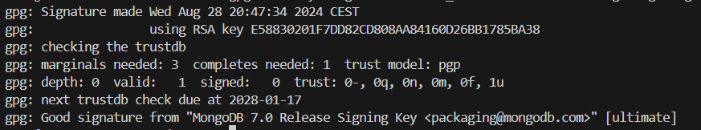

## Experiment 1
I executed the code using node.js

See my mongodb.js file. And to actually understand the output i ended all .find operations in .toArray

### Insert:

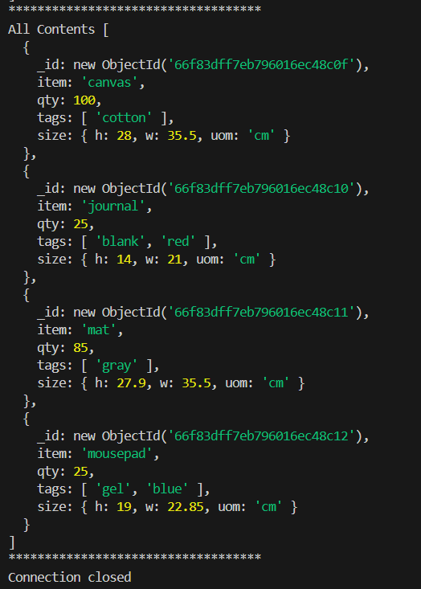  

### Find:
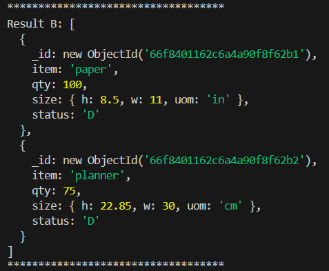 
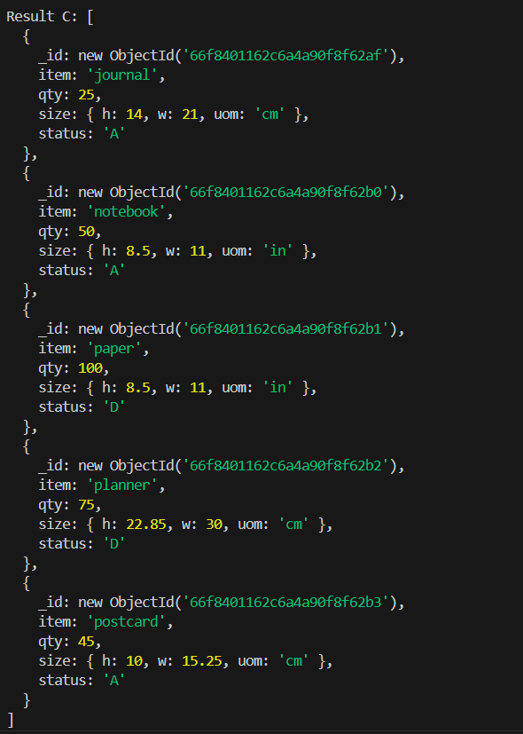 
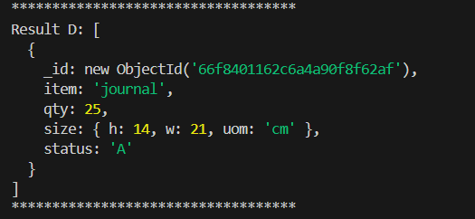 

### Delete
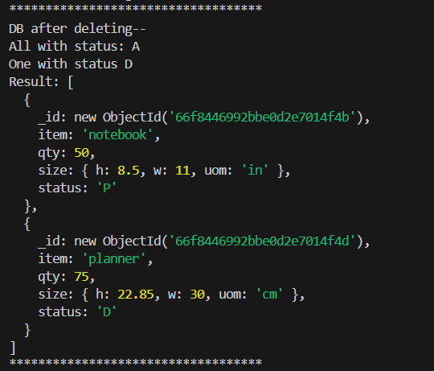 

### Modify 
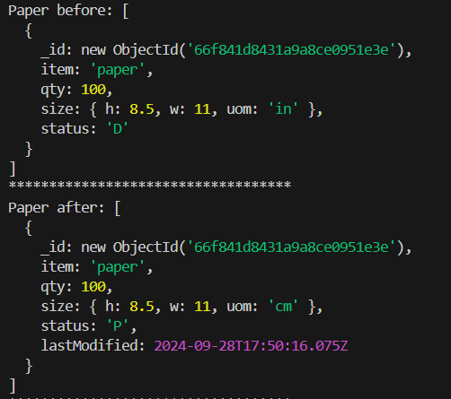 
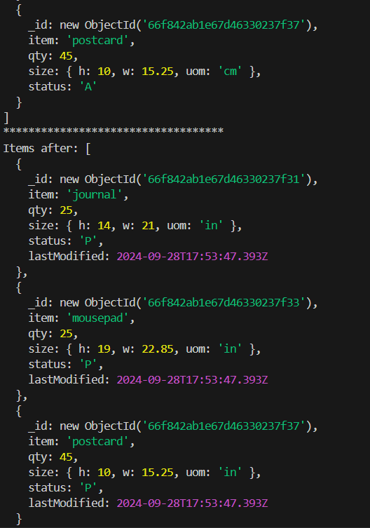 

### BulkWrite 
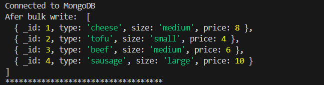 

## Experiment 2
can be found in mongodb-aggregationjs

Here's the working outputs from the tutorial
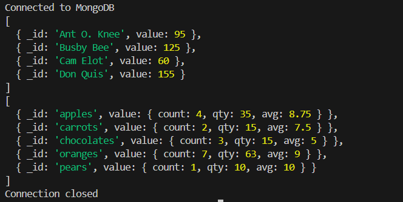 

the mapReduce function seemed depricated in the version of mongoDB we were using so i did the aggregation alternative instead. 
I tried asking about it but i never got an awnser so i just did it this way instead.

Thus i did implement my operation with aggregation instead of mapReduce
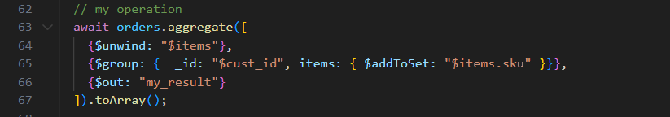 

And the output
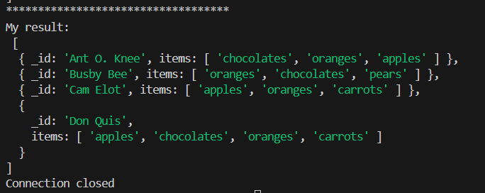 

### What is this and why?
I'm grouping the objects by their customer id and returning the set of items they have ever bought.

Could be useful for seeing which kinds of items they've purchased, ignoring duplicates.

## Technical issues
I just realised reading the installation guide again that i downloaded MongoDB 7.0 and not 4.4 

Hope thats not a major issue

My style fixes to the document are ignored in github and i didn't know
